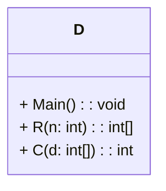

### Code to analyse

```csharp
using System;
using System.Collections.Generic;

class D
{
    static void Main()
    {
        int[] d = R(5);
        Array.Sort(d);
        Console.WriteLine("Values: " + string.Join(", ", d));
        int s = C(d);
        Console.WriteLine("Total: " + s);
    }

    static int[] R(int n)
    {
        Random r = new Random();
        int[] d = new int[n];
        for (int i = 0; i < n; i++)
        {
            d[i] = r.Next(1, 7);
        }
        return d;
    }

    static int C(int[] d)
    {
        int s = 0;
        Dictionary<int, int> c = new Dictionary<int, int>();
        foreach (int x in d)
        {
            if (c.ContainsKey(x))
            {
                c[x]++;
            }
            else
            {
                c[x] = 1;
            }
        }
        foreach (int v in c.Values)
        {
            switch (v)
            {
                case 2:
                    s += 10;
                    break;
                case 3:
                    s += 20;
                    break;
                case 4:
                    s += 30;
                    break;
                case 5:
                    s += 40;
                    break;
            }
        }
        return s;
    }
}
```

-----

### Explanation of the Code

This C\# code defines a class `D` with three `static` methods: `Main`, `R`, and `C`. It simulates a process of rolling dice, sorting the results, and then calculating a "score" based on the counts of each unique die roll.

#### 1\. `Main` Method (Entry Point)

```csharp
static void Main()
{
    // Calls the R (Roll) method to generate an array of 5 random integers.
    // This simulates rolling 5 dice.
    int[] d = R(5);

    // Sorts the generated array in ascending order.
    // For example, if 'd' was {3, 1, 6, 3, 5}, after sorting it becomes {1, 3, 3, 5, 6}.
    Array.Sort(d);

    // Prints the sorted array of "dice rolls" to the console.
    // string.Join(", ", d) converts the array into a comma-separated string (e.g., "1, 3, 3, 5, 6").
    Console.WriteLine("Values: " + string.Join(", ", d));

    // Calls the C (Calculate Score) method to compute a score based on the counts of each number in the array.
    int s = C(d);

    // Prints the calculated total score to the console.
    Console.WriteLine("Total: " + s);
}
```

  * **Purpose:** This is the entry point where the program execution begins. It orchestrates the flow: generating data, processing it, and displaying the final result.
  * **Analogy:** Imagine a game where you roll 5 dice, arrange them, then calculate points based on how many times each number appeared.

#### 2\. `R` Method (Roll Dice)

```csharp
static int[] R(int n)
{
    Random r = new Random(); // Initializes a new random number generator.
    int[] d = new int[n];   // Creates an integer array to hold 'n' dice rolls.
    for (int i = 0; i < n; i++)
    {
        // Fills each element of the array with a random integer.
        // r.Next(1, 7) generates numbers from 1 (inclusive) up to 7 (exclusive),
        // meaning it produces integers 1, 2, 3, 4, 5, or 6, simulating a standard die.
        d[i] = r.Next(1, 7);
    }
    return d; // Returns the array of generated random numbers.
}
```

  * **Purpose:** This method simulates the action of rolling dice.
  * **Parameters:** `n` (an integer) - specifies how many dice to "roll".
  * **Returns:** An `int[]` (an array of integers) containing the random results.

#### 3\. `C` Method (Calculate Score)

```csharp
static int C(int[] d)
{
    int s = 0; // Initializes the total score to 0.

    // Creates a Dictionary to store the frequency (count) of each unique number encountered in the input array 'd'.
    // The 'Key' of the dictionary will be the die roll (e.g., 1, 2, 3, 4, 5, 6).
    // The 'Value' will be the number of times that die roll appeared.
    Dictionary<int, int> c = new Dictionary<int, int>();

    // First loop: Iterates through each die roll in the input array 'd' to count occurrences.
    foreach (int x in d)
    {
        if (c.ContainsKey(x)) // Checks if the number 'x' has already been seen.
        {
            c[x]++; // If yes, increments its existing count.
        }
        else // If no, it's the first time we've seen this number.
        {
            c[x] = 1; // Adds the number to the dictionary with a count of 1.
        }
    }

    // Second loop: Iterates through the *counts* (values) stored in the dictionary to calculate the score.
    foreach (int v in c.Values)
    {
        // Uses a switch statement to apply scoring rules based on the count 'v'.
        switch (v)
        {
            case 2: // If a number appeared 2 times (a "pair")
                s += 10; // Add 10 points to the total score.
                break;
            case 3: // If a number appeared 3 times ("three of a kind")
                s += 20; // Add 20 points.
                break;
            case 4: // If a number appeared 4 times ("four of a kind")
                s += 30; // Add 30 points.
                break;
            case 5: // If a number appeared 5 times ("five of a kind")
                s += 40; // Add 40 points.
                break;
            // Counts of 1 (single) are not explicitly handled, so they add 0 points.
            // (A count of 6 is not possible with only 5 dice).
        }
    }
    return s; // Returns the final calculated score.
}
```

  * **Purpose:** This method computes a score based on the frequency of identical numbers in the dice rolls.
  * **Parameters:** `d` (an `int[]`) - the array of dice roll results.
  * **Returns:** An `int` representing the calculated score.

-----

### Class Diagram

Here's the class diagram for the provided code. It's a very simple structure with one class and three static methods.



  * **`class D`**: This box represents the single class named `D`.
  * **`+ Main() : void`**: A public method named `Main` that takes no parameters and returns nothing (`void`).
  * **`+ R(n: int) : int[]`**: A public method named `R` that takes an integer parameter `n` and returns an array of integers (`int[]`).
  * **`+ C(d: int[]) : int`**: A public method named `C` that takes an integer array parameter `d` and returns an integer (`int`).

All methods are implicitly `static` here because they are called directly from `Main` without an instance of `D`. In C\#, methods called this way in a simple console application are typically static.

-----

### Explanation of Stacks and Queues

Stacks and Queues are fundamental **abstract data types (ADTs)**, which means they define a set of operations without specifying how those operations are implemented. They are based on specific ordering principles for adding and removing elements.

#### 1\. Stack (Pilha)

A Stack is a **LIFO (Last-In, First-Out)** data structure. Imagine a stack of plates: you can only add a new plate on top, and you can only take a plate from the top.

  * **Key Operations:**

      * **Push:** Adds an element to the top of the stack.
      * **Pop:** Removes and returns the element from the top of the stack.
      * **Peek (or Top):** Returns the element at the top of the stack without removing it.
      * **IsEmpty:** Checks if the stack contains any elements.

  * **Analogy:**

      * A stack of books.
      * The "Undo" functionality in software (the last action you took is the first one undone).
      * Function call stack in programming (when a function calls another, the new function is "pushed" onto the stack; when it finishes, it's "popped").

  * **In C\#:** The `System.Collections.Generic.Stack<T>` class implements a stack.

    ```csharp
    Stack<int> myStack = new Stack<int>();
    myStack.Push(10); // Stack: [10]
    myStack.Push(20); // Stack: [10, 20]
    myStack.Push(30); // Stack: [10, 20, 30]

    Console.WriteLine(myStack.Pop()); // Output: 30 (removes 30)
    Console.WriteLine(myStack.Peek()); // Output: 20 (does not remove 20)
    ```

#### 2\. Queue (Fila)

A Queue is a **FIFO (First-In, First-Out)** data structure. Imagine a line of people waiting: the first person to get in line is the first person to be served.

  * **Key Operations:**

      * **Enqueue:** Adds an element to the rear (end) of the queue.
      * **Dequeue:** Removes and returns the element from the front (beginning) of the queue.
      * **Peek (or Front):** Returns the element at the front of the queue without removing it.
      * **IsEmpty:** Checks if the queue contains any elements.

  * **Analogy:**

      * A line at a supermarket checkout.
      * A print queue (documents are printed in the order they were sent).
      * Task scheduling in operating systems.

  * **In C\#:** The `System.Collections.Generic.Queue<T>` class implements a queue.

    ```csharp
    Queue<string> myQueue = new Queue<string>();
    myQueue.Enqueue("Task A"); // Queue: [Task A]
    myQueue.Enqueue("Task B"); // Queue: [Task A, Task B]
    myQueue.Enqueue("Task C"); // Queue: [Task A, Task B, Task C]

    Console.WriteLine(myQueue.Dequeue()); // Output: Task A (removes Task A)
    Console.WriteLine(myQueue.Peek());    // Output: Task B (does not remove Task B)
    ```

### Connection to the Provided Code

The provided C\# code **does not directly use** either a `Stack` or a `Queue`.

  * The `C` method uses a `Dictionary<int, int>` to count the occurrences of numbers, which is a hash table, not a stack or a queue. Dictionaries store key-value pairs and allow for quick lookup of values based on their keys.
  * Arrays (`int[]`) are used, but they are general-purpose collections that don't inherently enforce LIFO or FIFO behavior for element access like stacks or queues do. The `Array.Sort` method operates on the array's elements by rearranging them, which is a different concept from stack/queue operations.

While the code doesn't use stacks or queues, understanding these data structures is crucial in computer science because they are very common in algorithms for:

  * **Graph Traversal:** Breadth-First Search (BFS) uses a queue; Depth-First Search (DFS) often uses a stack (or recursion, which uses the call stack).
  * **Expression Evaluation:** Converting infix to postfix expressions, evaluating postfix expressions (stacks are key here).
  * **Operating Systems:** Managing processes, handling interrupts.
  * **Undo/Redo Functionality.**
  * **Web Browsers:** History management (back/forward buttons).
